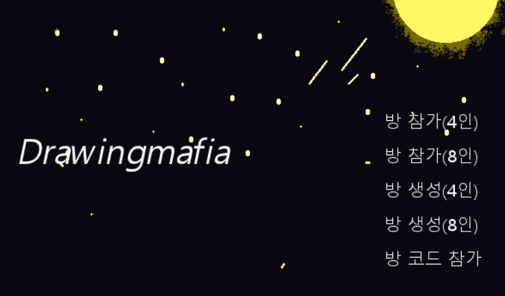
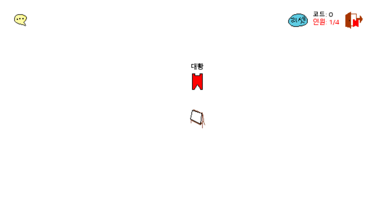

# DRAWING MAFIA
-----------------

- Language : Python(Pygame)
- Server : AWS(LightSail)
- DM.py 실행하면 게임 실행 가능
- 제시어를 받지 못한 그림 마피아를 찾는 멀티플레이 게임  
#
#
#
# 게임 룰
-----------
- 유저는 화면의 스케치북 근처로 가서 d키를 누르게 되면 그림을 그릴 수 있는 권한을 얻게 된다.(단 권한은 유저 1명)
- 권한을 얻은 유저는 오른쪽 마우스 버튼을 누른채로 한붓그리기 그림을 그릴 수 있다.(버튼을 떼게 되면 권한 자동 해제)
- 이미 그림을 그린 유저는 다른 유저들이 전부 한번씩 그림을 그릴 때 까지 다시 그림을 그릴 수 없다.
- 모든 유저가 한붓그리기를 한번씩 시행을 하였다면 투표를 진행하게 된다.
- 시민은 마피아 같은 유저의 번호를 적고, 마피아는 추리한 제시어를 적게 된다.
- 시민은 만장일치로만 마피아를 죽일 수 있다.
- 마피아가 제시어를 맞추고,동시에 시민이 마피아를 찾았다면 마피아의 승리가 된다.
- start는 방 인원이 다 차야 가능하다.
- 마피아가 방을 나가서 없게 될 경우에도 게임은 종료된다.
#
#
#
## 키, 버튼
-----
- 공격 : A
- 그리기 권한 : D
- 말풍선 : 채팅 활성화
- 문 : 방 나가기
- start : 게임시작
- reset : 대기중일 때 그리기 권한, 도화지 초기화
#
#
#
## COPYRIGHT KHJ